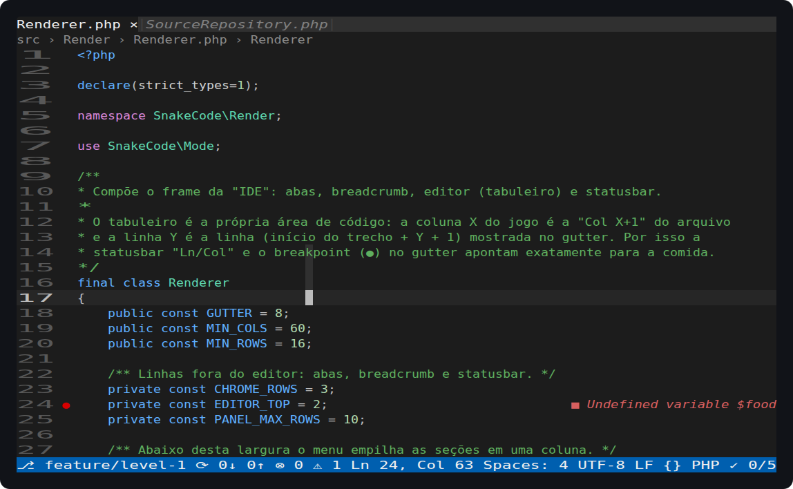

# SnakeCode

[English](README.en.md)

SnakeCode é Snake escondido dentro de uma IDE de terminal. A cobra anda pelo código: o cursor é a cabeça e o sublinhado do linter é a comida. Você pode jogar sobre o próprio código do SnakeCode ou usar outro projeto como fundo.



## 1. Gerar os pacotes

O projeto inclui um script que monta três formatos: um PHAR para qualquer sistema com PHP, um pacote para Linux/macOS/WSL e um instalador para Windows 64-bit. Os arquivos aparecem em `dist/`, que é ignorado pelo Git.

Para gerar tudo, use PHP 8.3 ou mais recente com as extensões `phar` e `zip` habilitadas. O pacote de Windows baixa o PHP portátil oficial durante a geração e confere o SHA-256 publicado, então precisa de acesso à internet.

```bash
php8.3 -d phar.readonly=0 build/package.php
```

Se o comando do seu PHP se chama `php`, troque `php8.3` por `php`. Para gerar apenas o PHAR e o pacote Linux, sem baixar o PHP para Windows, use:

```bash
php8.3 -d phar.readonly=0 build/package.php --no-windows
```

Ao terminar, `dist/` contém `snakecode.phar`, `snakecode-1.0.0-linux.tar.gz` e, se você não usou `--no-windows`, `snakecode-1.0.0-windows-x64.zip`.

## 2. Instalar

### Linux, macOS e WSL

O pacote exige PHP 8.3 ou mais recente, com `mbstring` e `tokenizer`. Extraia o arquivo e rode o instalador:

```bash
tar -xzf dist/snakecode-1.0.0-linux.tar.gz
cd snakecode-1.0.0-linux
sh install.sh
```

O instalador coloca o programa em `~/.local` e não precisa de `sudo`. Se ele avisar que `~/.local/bin` não está no `PATH`, adicione a linha que ele mostrar ao seu `~/.bashrc` e abra um terminal novo. Depois, execute `snakecode`.

### Windows 10/11 (x64)

Extraia o ZIP. Dentro da pasta `SnakeCode`, dê dois cliques em `install.cmd`. O pacote já inclui PHP 8.3 portátil, então você não precisa instalar PHP. O instalador cria o comando `snakecode` no `PATH` do usuário e um atalho no Menu Iniciar. Abra um terminal novo e rode `snakecode`.

Use Windows Terminal, PowerShell ou cmd. Git Bash e mintty não são suportados. Se o programa avisar que falta o Microsoft Visual C++ Redistributable 2015–2022 x64, instale-o pelo [site da Microsoft](https://aka.ms/vs/17/release/vc_redist.x64.exe).

### Usar o PHAR

Se você já tem PHP 8.3 ou mais recente, pode executar o PHAR diretamente, sem instalar:

```bash
php dist/snakecode.phar
```

No Windows, o PHP precisa ter FFI habilitado (`extension=ffi` e `ffi.enable=true`) e o jogo deve ser aberto no Windows Terminal, PowerShell ou cmd.

## 3. Executar pelo código, sem instalador

Para rodar o repositório clonado, você precisa de PHP 8.3 ou mais recente com `mbstring` e `tokenizer`. Não precisa de `composer install` para iniciar o jogo: o carregamento das classes já é feito por `bootstrap.php`.

```bash
php8.3 bin/snakecode
```

No Windows, use PowerShell ou cmd:

```powershell
php bin\snakecode
```

Para rodar pelo código-fonte no Windows, habilite FFI no `php.ini` (`extension=ffi` e `ffi.enable=true`) e use Windows Terminal, PowerShell ou cmd. Git Bash e mintty não são suportados.

O jogo abre usando o código do SnakeCode como fundo. Para sair, pressione `q` ou `Ctrl+C`.

## 4. Jogar usando outro projeto como fundo

Passe o caminho da pasta do projeto como argumento. O mesmo comando funciona com a versão instalada, com o PHAR ou pelo código-fonte:

```bash
snakecode /caminho/do/meu-projeto
php8.3 bin/snakecode /caminho/do/meu-projeto
php dist/snakecode.phar /caminho/do/meu-projeto
```

No Windows, coloque o caminho entre aspas se ele tiver espaços:

```powershell
snakecode "C:\Users\Cesar\meu projeto"
php bin\snakecode "C:\Users\Cesar\meu projeto"
```

Você também pode escolher quantos arquivos entram no editor ou o nível de discrição da cobra:

```bash
snakecode --files=80 --stealth=medium /caminho/do/meu-projeto
```

Em um repositório Git, o SnakeCode usa arquivos versionados e arquivos novos que não estejam ignorados pelo `.gitignore`. Fora do Git, ele pula `vendor/`, `node_modules/`, `storage/`, `cache/`, `dist/`, `build/`, `coverage/`, pastas ocultas e outras pastas de dependências. São exibidos arquivos de código, com até 128 KB cada. `.env*` e arquivos com nomes como `secrets.php` ou `credentials.js` ficam de fora.

Por padrão, são escolhidos até 40 arquivos de código, começando pelos editados mais recentemente. Eles só são lidos quando a aba correspondente abre.

## Controles

| Tecla | Ação |
|---|---|
| Setas / WASD / hjkl | mover; a primeira tecla também inicia a partida |
| `m` | abrir o menu e pausar |
| `p` ou espaço | pausar ("Paused on breakpoint") |
| `v` | alternar a discrição: `subtle`, `medium` ou `easy` |
| `Esc` ou `` ` `` | esconder o jogo e deixar só o código na tela; pressione de novo para voltar pausado |
| `Enter` | reiniciar depois do game over |
| `q` / Ctrl+C | sair e restaurar o terminal |

No menu, use ↑ / ↓ e Enter para escolher uma opção; ← / → trocam o perfil de discrição. Passe `--no-menu` na linha de comando para pular o menu.

## O que aparece no editor

| Elemento da IDE | Elemento do jogo |
|---|---|
| Cursor em bloco | cabeça da cobra |
| Fundo de seleção atrás do cursor | corpo |
| Sublinhado ondulado vermelho | comida |
| `●` no gutter e `Ln X, Col Y` na statusbar | linha e coluna da comida |
| `■ Undefined variable $food at col N` | dica na linha da comida |
| `▸ ⋯ N lines` (região dobrada) | obstáculo a partir do nível 3 |
| Branch `feature/level-N` | nível atual |
| Nova aba | cada curva abre outro arquivo do projeto |
| Painel TERMINAL com `PHP Fatal error` | game over, com o stack trace da colisão |

## Testes

```bash
composer install
composer test
```
